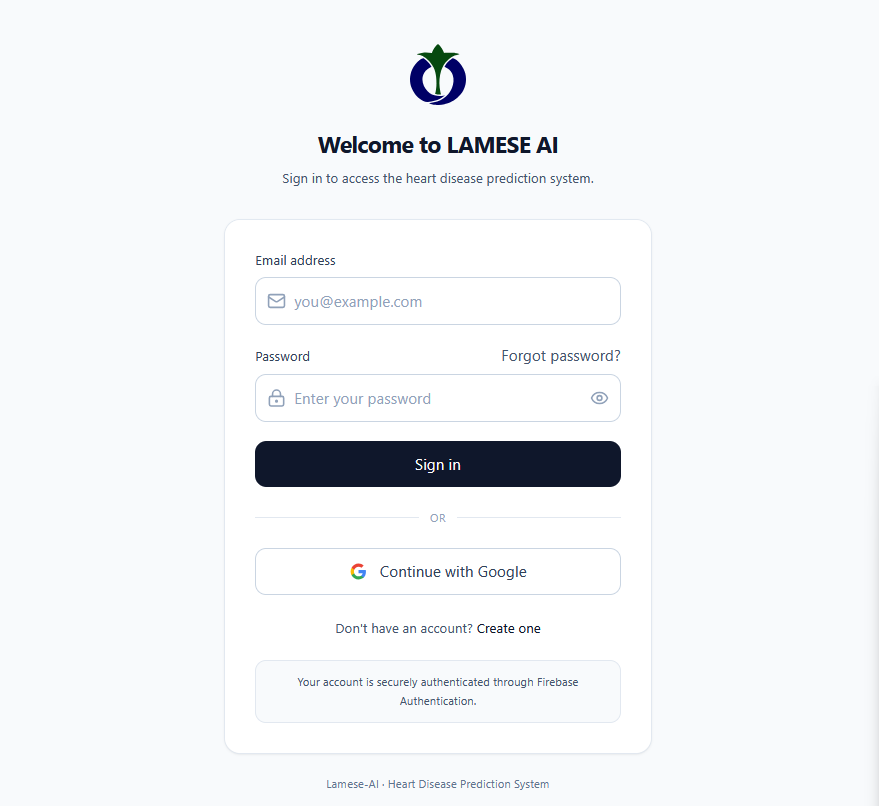
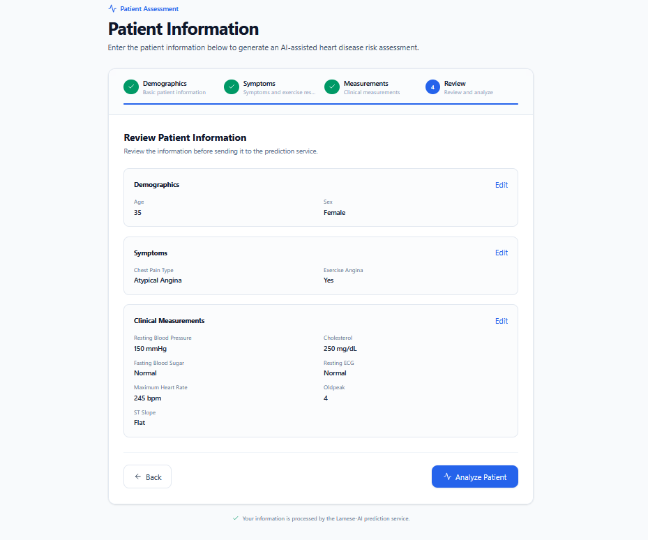
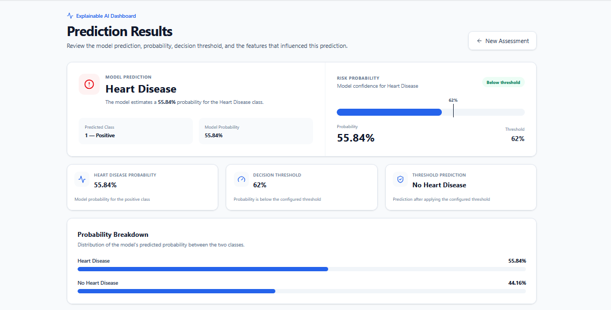
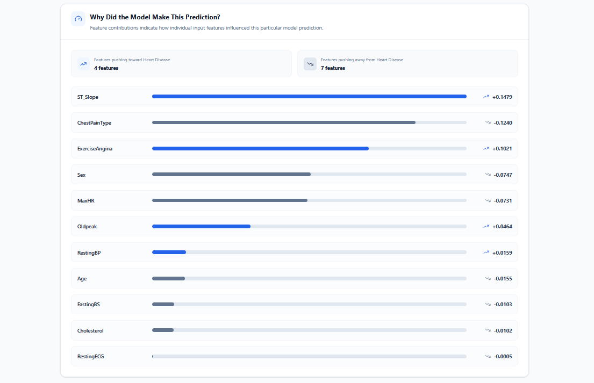

# LAMESE AI

LAMESE AI is a full-stack machine learning application for heart disease risk prediction using structured patient health data.

The project combines a trained and persisted machine learning pipeline with a FastAPI backend, Firebase authentication, a React frontend, configurable decision thresholding, and SHAP based explainability.

> **Medical disclaimer:** LAMESE AI is an educational and research oriented machine learning project. Its predictions are not medical diagnoses and should not be used as a substitute for professional medical advice, examination, or treatment.

## Screenshots

### Login



### Patient Assessment



### Prediction Result



### Explainability Dashboard



## Features

### Machine Learning

* Heart disease classification with Random Forest
* Numerical and categorical feature preprocessing
* Persisted scikit-learn pipeline
* Probability prediction
* Configurable classification threshold
* Cross-validation
* Multiple evaluation metrics
* SHAP based feature explanations

### Application

* Email and password authentication
* Google OAuth authentication
* Session restoration
* Password reset
* Authenticated prediction requests
* Four step patient assessment form
* Prediction probability display
* Threshold-Based classification
* SHAP feature contribution display
* API availability monitoring
* New assessment workflow
* Responsive React interface
* Custom LAMESE AI branding

### Engineering

* Modular Python backend
* FastAPI REST API
* Pydantic request validation
* Configuration driven application settings
* Structured logging
* Automated testing with pytest
* HTTP API testing with HTTPX
* Persisted model artifact
* Docker support
* Docker Compose support
* Production frontend build with Vite

## Technology Stack

| Area             | Technologies                                 |
| ---------------- |----------------------------------------------|
| Frontend         | React, Vite, Tailwind CSS, Lucide React      |
| Backend          | Python 3.11, FastAPI, Uvicorn, Pydantic      |
| Machine Learning | scikit-learn, pandas, NumPy, SHAP            |
| Authentication   | Firebase Authentication                      |
| Testing          | pytest, HTTPX                                |
| Deployment       | Render, Docker, Docker Compose               |
| Configuration    | JSON configuration and environment variables |

## System Architecture

```text
                    ┌─────────────────────────┐
                    │      React Frontend     │
                    │                         │
                    │  Authentication         │
                    │  Patient Assessment     │
                    │  Results Dashboard      │
                    └────────────┬────────────┘
                                 │
                         Bearer access token
                                 │
                                 ▼
                    ┌─────────────────────────┐
                    │      FastAPI API        │
                    │                         │
                    │  Authentication         │
                    │  Validation             │
                    │  Prediction             │
                    │  Health Checks          │
                    └────────────┬────────────┘
                                 │
                                 ▼
                    ┌─────────────────────────┐
                    │ Persisted ML Pipeline   │
                    │                         │
                    │ Preprocessing           │
                    │ Random Forest           │
                    │ Probability             │
                    │ Threshold               │
                    └────────────┬────────────┘
                                 │
                                 ▼
                    ┌─────────────────────────┐
                    │     SHAP Explainability │
                    │                         │
                    │ Feature Contributions   │
                    │ Original Feature Names  │
                    └─────────────────────────┘
```

## Application Workflow

```text
User Authentication
        ↓
Patient Assessment
        ↓
Authenticated Prediction Request
        ↓
Input Validation
        ↓
Persisted ML Pipeline
        ↓
Probability Prediction
        ↓
Decision Threshold
        ↓
SHAP Explanation
        ↓
Results Dashboard
```

## Dataset

The project uses a heart disease dataset containing:

* **918 rows**
* **12 columns**
* **11 input features**
* **1 target variable**

### Input Features

#### Numerical

* `Age`
* `RestingBP`
* `Cholesterol`
* `FastingBS`
* `MaxHR`
* `Oldpeak`

#### Categorical

* `Sex`
* `ChestPainType`
* `RestingECG`
* `ExerciseAngina`
* `ST_Slope`

### Target

```text
HeartDisease
```

The target represents the heart disease classification used by the dataset.

## Data Preprocessing

The machine learning pipeline separates numerical and categorical features.

Numerical features are processed using:

* Median imputation
* Standard scaling

Categorical features are processed using:

* Most frequent value imputation
* One hot encoding
* `handle_unknown="ignore"`

The preprocessing and model are stored together in the persisted scikit-learn pipeline.

This keeps training and inference preprocessing consistent.

## Machine Learning Model

The final persisted model is a `RandomForestClassifier`.

### Persisted model parameters

```text
n_estimators = 100
max_depth = 5
min_samples_split = 10
random_state = 42
```

The trained pipeline is stored at:

```text
artifacts/model.pkl
```

The application loads this persisted pipeline for inference instead of retraining the model when a prediction is requested.

## Model Evaluation

The final evaluation on the held out test set produced:

| Metric    | Result |
| --------- | -----: |
| Accuracy  |   0.88 |
| Precision |   0.89 |
| Recall    |   0.89 |
| F1 Score  |   0.89 |
| ROC-AUC   |   0.95 |

The test set contained **138 samples**.

### Confusion Matrix

```text
[[54,  8],
 [ 8, 68]]
```

This corresponds to:

```text
True Negatives  = 54
False Positives = 8
False Negatives = 8
True Positives  = 68
```

These results describe performance on this dataset and should not be interpreted as evidence of clinical performance.

## Cross-Validation

The final model evaluation also included cross-validation.

| Metric    | Mean |
| --------- | ---: |
| Accuracy  | 0.86 |
| Precision | 0.85 |
| Recall    | 0.91 |
| F1 Score  | 0.88 |
| ROC-AUC   | 0.92 |

Cross-validation was used to examine model performance across multiple training and validation splits rather than relying only on one held out test set.

## Decision Threshold

The application uses a configurable decision threshold in addition to the model's probability output.

The threshold selection configuration is:

```text
Minimum recall: 0.90
Search range:   0.30 to 0.70
Step:           0.01
Selected:       0.62
```

The threshold selection process evaluates candidate probability thresholds and selects a threshold that satisfies the configured minimum recall requirement while considering precision.

This separates:

```text
Model probability
        ↓
Decision threshold
        ↓
Application classification
```

The selected threshold is stored in the application configuration and is not hard coded inside the prediction interface.

## Explainable AI

LAMESE AI uses SHAP to explain individual model predictions.

The explainability layer:

* Calculates feature contributions
* Identifies features pushing the prediction toward or away from the positive class
* Handles one hot encoded categorical variables
* Aggregates encoded contributions back to their original feature names
* Returns explanation data to the frontend

A positive contribution indicates that a feature contributed toward the model's positive class for that prediction. A negative contribution indicates contribution in the opposite direction.

SHAP explanations describe the behaviour of the machine learning model. They do **not** establish medical causation.

## Backend API

The backend is implemented with FastAPI.

### Health

```http
GET /health
```

Provides a public service health endpoint.

### Readiness

```http
GET /ready
```

Checks whether the application configuration and required model artifact are available.

### Prediction

```http
POST /predict
```

The prediction endpoint requires an authenticated Firebase ID token.

The request contains validated patient health information. The response includes:

* Prediction
* Probability
* Threshold-Based prediction
* Selected threshold
* SHAP explanation

The backend verifies the Firebase bearer token before processing prediction requests.

## Authentication

Authentication is handled through Firebase Authentication.

The frontend currently supports:

* Email and password authentication
* Google OAuth
* Session restoration
* Sign out
* Password reset

The frontend obtains the authenticated Firebase session and sends its access token to the backend.

The backend validates the token before allowing access to `/predict`.

The frontend manages the user session through Firebase Authentication, while the API independently verifies the Firebase ID token before processing prediction requests.

## Frontend

The frontend is built with React and Vite.

The main application flow contains:

```text
Splash Screen
      ↓
Login
      ↓
Patient Assessment
      ↓
Prediction
      ↓
Explainability Dashboard
```

The patient assessment is divided into four stages:

1. Demographics
2. Symptoms
3. Clinical Measurements
4. Review and Analysis

The results dashboard presents the prediction, probability, Threshold-Based result, and SHAP feature contributions.

## Project Structure

```text
lamese-ai/
│
├── app/
│   ├── application.py
│   ├── api/
│   │   ├── __init__.py
│   │   ├── main.py
│   │   └── schemas.py
│   │
│   ├── core/
│   │   ├── auth.py
│   │   ├── config_loader.py
│   │   ├── logger.py
│   │   └── settings.py
│   │
│   ├── data/
│   │   ├── __init__.py
│   │   ├── dataset_loader.py
│   │   ├── exceptions.py
│   │   ├── preprocessor.py
│   │   ├── splitter.py
│   │   └── validator.py
│   │
│   └── ml/
│       ├── __init__.py
│       ├── cross_validation.py
│       ├── evaluate_model.py
│       ├── evaluator.py
│       ├── exceptions.py
│       ├── inference.py
│       ├── model_factory.py
│       ├── model_persistence.py
│       ├── pipeline.py
│       ├── predictor.py
│       ├── protocol.py
│       ├── threshold.py
│       ├── trainer.py
│       ├── training.py
│       ├── train_model.py
│       ├── tuner.py
│       └── explainability/
│           ├── __init__.py
│           └── shap_explainer.py
│
├── artifacts/
│   └── model.pkl
│
├── config/
│   └── config.json
│
├── datasets/
│   └── heart_disease.csv
│
├── frontend/
│   ├── public/
│   │   ├── favicon.svg
│   │   ├── icons.svg
│   │   └── lamese-logo.svg
│   │
│   └── src/
│       ├── components/
│       │   └── SplashScreen.jsx
│       ├── context/
│       │   └── AuthContext.jsx
│       ├── pages/
│       │   ├── ExplainabilityDashboard.jsx
│       │   ├── Login.jsx
│       │   ├── PatientInput.jsx
│       │   └── ResetPassword.jsx
│       └── services/
│           ├── authService.js
│           ├── healthService.js
│           ├── predictionService.js
│           └── firebaseClient.js
│
├── tests/
├── .dockerignore
├── docker-compose.yml
├── Dockerfile
├── main.py
├── requirements.txt
└── README.md
```

## Environment Variables

### Backend

The backend requires:

```text
FIREBASE_CREDENTIALS_PATH=
```

### Frontend

The frontend requires:

```text
VITE_API_URL=
VITE_FIREBASE_API_KEY=
VITE_FIREBASE_AUTH_DOMAIN=
VITE_FIREBASE_PROJECT_ID=
VITE_FIREBASE_STORAGE_BUCKET=
VITE_FIREBASE_MESSAGING_SENDER_ID=
VITE_FIREBASE_APP_ID=
```

Create the appropriate local environment file for the frontend.

Do not commit secrets or environment files containing credentials.

## Local Development

### Backend

From the project root:

```powershell
cd D:\projects\lamese-ai
python -m venv .venv
.venv\Scripts\Activate.ps1
pip install -r requirements.txt
```

Start the API:

```powershell
uvicorn app.api.main:app --reload
```

The local API runs on:

```text
http://127.0.0.1:8000
```

### Frontend

Open a second terminal:

```powershell
cd D:\projects\lamese-ai\frontend
npm install
npm run dev
```

The Vite development server normally runs on:

```text
http://localhost:5173
```

The actual URL displayed by Vite should be used if the development server selects a different port.

## Production Deployment

LAMESE AI is deployed using Render.

### Frontend

The React frontend is deployed as a Render Static Site.

Production URL:

```text
https://lamese-ai.onrender.com
```

The frontend uses the production backend URL through:

```text
VITE_API_URL=https://lamese-ai-api.onrender.com
```

Firebase Authentication is configured for the production frontend domain.

### Backend

The FastAPI backend is deployed as a Render Web Service using the project Dockerfile.

Production URL:

```text
https://lamese-ai-api.onrender.com
```

The backend uses a Render secret file for the Firebase Admin SDK service account credentials.

The production backend exposes:

```http
GET /health
GET /ready
POST /predict
```

The `/predict` endpoint requires a valid Firebase ID token.

### Production Architecture

```text
Render Static Site
        │
        │ HTTPS
        ▼
React Frontend
        │
        │ Firebase ID Token
        ▼
Render Web Service
        │
        │ Docker
        ▼
FastAPI Backend
        │
        ▼
Persisted ML Pipeline
```

## Testing

Run the backend test suite from the project root:

```powershell
python -m pytest -q
```

The current verified result is:

```text
30 passed
```

The current test run also reports three `PendingDeprecationWarning`s originating from the installed SHAP dependency. These warnings do not cause test failures.

## Frontend Production Build

From the frontend directory:

```powershell
npm run build
```

The current verified production build completes successfully.

The current build used:

```text
Vite 8.2.2
1,857 modules transformed
```

Generated asset filenames are intentionally not documented because Vite generates hashed filenames during each build.

## Docker

Build the backend image:

```powershell
docker build -t lamese-ai:0.1.0 .
```

The current Docker image builds successfully from the project Dockerfile.

Run the container:

```powershell
docker run --name lamese-ai -p 8000:8000 lamese-ai:0.1.0
```

The API is exposed on:

```text
http://127.0.0.1:8000
```

The health endpoint can be checked with:

```powershell
Invoke-WebRequest http://127.0.0.1:8000/health
```

The current project has also been verified with a running `lamese-ai` container responding successfully on port `8000`.

## Docker Compose

The project includes Docker Compose configuration.

Start the services with:

```powershell
docker compose up --build
```

Stop the services with:

```powershell
docker compose down
```

## What I Learned

This project helped me move from developing isolated machine learning models toward building complete machine learning applications.

### Machine Learning

I developed practical experience with:

* Dataset inspection and validation
* Numerical and categorical feature processing
* Model training
* Model evaluation
* Cross-validation
* Probability prediction
* Decision threshold selection
* Model persistence
* Loading persisted models for inference

### Explainable AI

I learned how to integrate SHAP into an application and how to handle explanations when categorical variables have been one hot encoded.

An important lesson was that model explanation is different from medical causation.

### Backend Engineering

I learned how to:

* Build APIs with FastAPI
* Define request and response contracts
* Validate data with Pydantic
* Load persisted ML models
* Protect API endpoints with authentication
* Handle API errors
* Implement health and readiness checks
* Test API behaviour

### Frontend Engineering

I gained practical experience with:

* React components
* State management
* Multi step forms
* Authentication flows
* Asynchronous API requests
* Loading and error states
* Prediction dashboards
* Responsive interfaces
* Tailwind CSS
* Frontend service modules

### Software Engineering

The project reinforced the importance of:

* Modular architecture
* Clear contracts
* Configuration management
* Logging
* Testing
* Version control
* Reproducible environments
* Documentation
* Incremental development
* Minimal changes to working systems

A key engineering principle from this project is:

> **Separate the ML framework from the ML problem.**

## What I Am Learning Now

My current learning direction is focused on stronger machine learning engineering and AI engineering practices.

Areas include:

* Production machine learning workflows
* Model validation
* Feature engineering
* Model serving
* Model monitoring
* Reproducible ML systems
* Explainable AI
* Responsible AI
* AI system evaluation
* FastAPI
* React
* Docker
* Testing
* Git and GitHub
* Machine learning system architecture
* Technical research and experimentation

My broader direction combines:

```text
Software Engineering
        +
Machine Learning
        +
AI Engineering
        +
Explainable AI
```

## Limitations

### Dataset

The model was developed using a relatively small structured dataset. Its results should not be assumed to generalize to every population or clinical setting.

### Model

The model learns statistical patterns from the available training data. A prediction does not establish a diagnosis or causal relationship.

### Explainability

SHAP describes how model features contributed to a model output. It does not establish medical causation.

### Clinical Use

LAMESE AI has not been presented as a clinically validated diagnostic system. It should not be used to make medical decisions.

## Medical Disclaimer

LAMESE AI is intended for:

* Education
* Machine learning research
* Software engineering demonstration
* Explainable AI experimentation

It is not intended to:

* Diagnose disease
* Replace a physician
* Recommend treatment
* Replace clinical examination
* Provide emergency medical advice

For medical decisions, users should consult qualified healthcare professionals.

## Development Principles

### Contract First

Existing interfaces and contracts should be preserved unless there is a demonstrated reason to change them.

### Minimal Change

Working functionality should not be changed unnecessarily.

### Test Before Commit

Changes should be verified through relevant tests and application workflows before being committed.

### Reproducibility

Training, inference, testing, and deployment workflows should remain reproducible.

### Explainability

Where appropriate, predictions should provide interpretable information about model behaviour rather than presenting only a classification result.

## Future Improvements

Potential future work includes:

* Larger and more diverse datasets
* External validation
* Model calibration
* Model monitoring
* Prediction logging and analytics
* Improved explainability visualizations
* Automated CI/CD
* Production observability
* More comprehensive frontend testing
* Accessibility improvements
* Further clinical validation research

These improvements depend on the intended research, educational, and deployment requirements of the project.

## Developer

**Ernest Edem Dzisah** is a Computer Science and Engineering student focused on Software Engineering and Artificial Intelligence and Machine Learning.

His technical interests include machine learning, data science, Python development, and building practical software systems that combine data, automation, and intelligent decision making.

### Technical Interests

* Software Engineering
* Machine Learning
* Artificial Intelligence
* AI Engineering
* Explainable AI
* Full Stack Development
* Machine Learning Engineering

### Design and Technical Background

Alongside software and machine learning development, I have experience in:

* Web design and development
* Drupal development and maintenance
* UI/UX design
* Graphic design
* Photography
* Digital content development

This background helps me combine technical implementation with user experience and visual communication.

## Contact

**Email:** [ernestedem.d@gmail.com](mailto:ernestedem.d@gmail.com)

**GitHub:** [github.com/ernest-edem](https://github.com/ernest-edem)

**LinkedIn:** [linkedin.com/in/ernest-edem-dzisah](https://www.linkedin.com/in/ernest-edem-dzisah)
